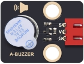
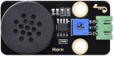

**关于keyes**

Keyes是KEYES Corporation旗下最畅销的品牌，我们的产品包括Arduino开发板、扩展板、传感器模块；树莓派、micro：bit扩展板和智能小车；以及为各阶段客户设计的完整入门套件。这些入门套件旨在为任何水平的客户学习Arduino、树莓派、micro：bit相关知识。
我们所有产品，均符合国际质量标准，在世界各地不同市场中，得到了极大的赞赏。 
欢迎从我们的官方网站查看更多内容：
http://www.keyes-robot.com

---

**获取售后服务**

1. 如果发现某些东西丢失或损坏，或者学习套件时遇到一些困难。keyes会提供免费和快速的支持，如果您有任何疑问，请联系我们专业的销售人员。

2. 欢迎提出建议和反馈，我们会根据您的反馈不断更新套件和教程，以使其更好。谢谢！

---

**产品安全**                               

1. 本产品内含细小的零件（螺丝，铜柱等），请放在儿童接触不到的地方，防止划伤或误食。8岁及以下儿童使用，请在大人监督下使用。
2. 本产品包含导电部件(控制板和电子模块），请按照本教程的要求进行操作，不当的操作可能导致过热并且损害零件，请勿触摸并立即断开电路电源（请按照正确的方式安装电池）。

---

**版权**

keyes商标和徽标是KEYES DIY ROBOT co.,LTD的版权,任何人和公司在没有授权的情况下，不得复制，售卖，转卖，keyes品牌的产品。如果您有兴趣在当地售卖我们的产品，请联系我们专业的批发销售人员。

---

Keyes ESP32 24合1 传感器套装 介绍

# 产品介绍

您想学习编程吗？目前，编程已发展到较低年龄组，每个人都能编程将会是一种趋势。使用此产品和教程，您可以轻松了解并学习基于ESP32开发环境下24款传感器/模块原理及使用方法，学会编写程序使用它们。

Keyes ESP32 24合1 传感器套装主要包含了我们常用的24款传感器/模块，还有对应的ESP32主控板、ESP32扩展板和XH-2.54mm高温硅胶连接线。24款传感器/模块和我们提供的ESP32扩展板接口完全匹配。使用时，我们只需要用连接线将传感器/模块连接在ESP32主控板上，简单方便。

为了让你对这个24款传感器/模块有更深入的了解，我们还基于这个24款传感器/模块做了多个学习课程。这些课程适用于Raspberry Pi系统上的Arduino IDE C语言软件平台、Windows系统上的Arduino IDE C语言软件平台以及Windows系统上的MicroPython语言软件平台。课程中我们提供了对应的原理图、接线方法、Arduino C语言代码、实验结果和简单的代码介绍等信息。通过这些课程，可以让我们对编程方法、逻辑、电子电路有了更深刻的理解。       

此外，如果您对本教程和工具包有任何困难或问题，您可以随时向我们咨询。

---

# 产品清单

| 序号 | KE3053                  | KE3054                  | 规格                                                         | 倍用量 |
| ---- | ----------------------- | ----------------------- | ------------------------------------------------------------ | ------ |
| 1    |      |   | Keyes 2021新款 DIY电子积木 紫色LED模块 黑色环保（红色端子）  | 1      |
| 2    |   |   | Keyes 2021新款 DIY电子积木 共阴RGB模块 黑色环保（红色端子）  | 1      |
| 3    |   |   | Keyes 2021新款 DIY电子积木 交通灯模块 黑色环保（红色端子）   | 1      |
| 4    |   |   | Keyes 2021新款 DIY电子积木 有源蜂鸣器模块 黑色环保（红色端子） | 1      |
| 5    |   |  | Keyes 2021新款 DIY电子积木 8002b功放 喇叭模块 黑色环保（绿色端子） | 1      |
| 6    |  |  | Keyes 2021新款 DIY电子积木 单路按键模块 黑色环保（红色端子） | 1      |
| 7    |  |  | Keyes 2021新款 DIY电子积木 倾斜传感器 黑色环保（红色端子）   | 1      |
| 8    |  |  | Keyes 2021新款 DIY电子积木 人体红外热释传感器 黑色环保（红色端子） | 1      |
| 9    |  |  | Keyes 2021新款 DIY电子积木 避障传感器 黑色环保（红色端子）   | 1      |
| 10   |  |  | Keyes 2021新款 DIY电子积木 6812 RGB模块 黑色环保（红色端子） | 1      |
| 11   |  |  | Keyes 2021新款 DIY电子积木 NTC-MF52AT模拟温度传感器 黑色环保（绿色端子） | 1      |
| 12   |  |  | Keyes 2021新款 DIY电子积木 光敏电阻传感器 黑色环保（绿色端子） | 1      |
| 13   |  |  | Keyes 2021新款 DIY电子积木 声音传感器 黑色环保（绿色端子）   | 1      |
| 14   |  |  | Keyes 2021新款 DIY电子积木 旋转电位器传感器 黑色环保（绿色端子） | 1      |
| 15   |  |  | Keyes 2021新款 DIY电子积木 红外接收模块 黑色环保（蓝色端子） | 1      |
| 16   |  |  | Keyes 2021新款 DIY电子积木 干簧管模块 黑色环保（红色端子）   | 1      |
| 17   |  |  | Keyes 2021新款 DIY电子积木 旋转编码器模块 黑色环保（蓝色端子） | 1      |
| 18   |  |  | Keyes 2021新款 DIY电子积木 摇杆模块 黑色环保（黄色端子）     | 1      |
| 19   |  |  | Keyes 2021新款 DIY电子积木 HT16K33_8X8点阵模块 黑色环保（蓝色端子） | 1      |
| 20   |  |  | Keyes 2021新款 DIY电子积木 TM1650四位数码管模块 黑色环保（蓝色端子） | 1      |
| 21   |  |  | Keyes 2021新款 DIY电子积木 薄膜压力传感器 黑色环保（绿色端子） | 1      |
| 22   |  |  | Keyes 2021新款 DIY电子积木 DS1307时钟传感器模块 黑色环保（蓝色端子） | 1      |
| 23   |  |  | Keyes 2021新款 DIY电子积木 超声波转接模块 黑色环保（蓝色端子） | 1      |
| 24   |  |  | HC-SR04超声波传感器                                          | 1      |
| 25   |  |  | Keyestudio ESP32 PLUS开发板 黑色 环保                        | 1      |
| 26   |  |  | 9G 舵机 23 *12.2 *29mm 配十字臂 黑色 180度数字               | 1      |
| 27   |  |  | 红外遥控器 JMP-1 17键86 * 40 * 6.5MM 黑色 不带电池           | 1      |
| 28   |  |  | USB2.0对TYPE C 线 白色 L:1M OD：4.0MM                        | 1      |
| 29   |  |  | XH2.54-3P 转杜邦线母单线                                     | 15     |
| 30   |  |  | XH2.54-4P 转杜邦线母单线                                     | 5      |
| 31   |  |  | XH2.54-5P 转杜邦线母单线                                     | 3      |
| 32   |  |  | 按键帽 A24 黄帽(12 *12 *7.3)圆                               | 1      |
| 33   |  |  | 摇杆帽 3D PS2 蘑菇头环保                                     | 1      |

---

