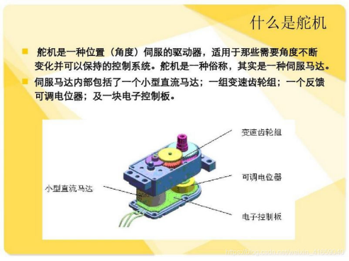

# 第二十一课 舵机的控制原理

## 1.1 项目介绍



舵机是一种位置伺服的驱动器，主要是由外壳、电路板、无核心马达、齿轮与位置检测器所构成。舵机有很多规格，但所有的舵机都有外接三根线。由于舵机品牌不同，颜色也会有所差异，我们实验用到的这款舵机分别用棕、红、橙三种颜色进行区分，棕色为接地线，红色为电源正极，橙色为信号线。


舵机分为360度舵机、180度舵机和90度舵机，我们实验用到的这款舵机为90度舵机，但是它转动的角度范围最大接近180度，所以我们也可把它当做180度舵机使用，控制原理都是一样的。


---

## 1.2 模块参数

工作电压 : DC 3.3 ~ 5V 

工作温度 ：-10°C ~ +50°C

尺寸 ：32.25 x 12.25 x 30.42 mm

接口 ：间距为2.54 mm 3pin接口

---

## 1.3 模块原理图


舵机的控制信号是周期为20ms （50Hz）的PWM（脉冲宽度调制）信号。

舵机的转动的角度是通过调节PWM信号的占空比来实现的，一般在 0.5ms ~ 2.5ms 的范围内去控制，总间隔为 2ms，相对应舵盘的位置为0度 ~ 180度，呈线性变化。当脉冲宽度为 1.5ms 时，舵机旋转至中间角度，大于 1.5ms 时舵机旋转角度增大，小于 1.5ms 时舵机旋转角度减小。

也就是说，舵机的控制需要单片机产生一个周期为20ms的脉冲信号，以0.5ms到2.5ms的高电平来控制舵机转动的角度。具体脉冲参数下图所示：


注意，由于舵机品牌不同，对于同一信号，不同品牌的舵机旋转的角度也会有所不同。

---

## 1.4 实验组件

|  |  |  |
| ------------------------ | -------------------- | --------------------- |
| ESP32 Plus主板 x1        | 9G 180度数字舵机 x1  | USB线  x1             |

---

## 1.5 实验

### 1.5.1 实验①：

#### （1）实验接线图


#### （2）实验代码

本项目中使用的代码保存在文件夹“<u>**3. Arduino教程\2. Windows 系统\1. 项目课程\代码**</u>”中，我们可以在此路径下打开代码文件''**servo_1.ino**"。

```c++
/*
 * Filename    : Servo_1
 * Description : Steering gear rotation Angle 0-90-180, repeatly
 * Auther      : http//www.keyestudio.com
*/
int servoPin = 4;//steering gear PIN

void setup() {
  pinMode(servoPin, OUTPUT);//steering pin is set to output
}
void loop() {
  servopulse(servoPin, 0);//Rotate it to zero degrees
  delay(1000);//delay 1S
  servopulse(servoPin, 90);//Rotate it to 90 degrees
  delay(1000);
  servopulse(servoPin, 180);//Rotate it to 180 degrees
  delay(1000);
}

void servopulse(int pin, int myangle) { //Impulse function
  int pulsewidth = map(myangle, 0, 180, 500, 2500); //Map Angle to pulse width
  for (int i = 0; i < 10; i++) { //Output a few more pulses
    digitalWrite(pin, HIGH);//Set the steering gear interface level to high
    delayMicroseconds(pulsewidth);//The number of microseconds of delayed pulse width value
    digitalWrite(pin, LOW);//Lower the level of steering gear interface
    delay(20 - pulsewidth / 1000);
  }
}
```

ESP32主板通过USB线连接到计算机后开始上传代码。为了避免将代码上传至ESP32主板时出现错误，必须选择与计算机连接正确的控制板和串行端口。

点击“**<u>工具</u>**”→“**<u>开发板</u>**”，可以查看到各种不同型号ESP32开发板，选择对应的ESP32开发板型号。

点击“<u>**工具**</u>”→“**<u>端口</u>**”，选择对应的串行端口。

**注意：将ESP32主板通过USB线连接到计算机后才能看到对应的串行端口**。

单击将代码上传到ESP32主控板，等待代码上传成功后查看实验结果。

#### （3）实验结果

代码上传成功后，拔下USB线断电，按照接线图正确接好舵机后再用USB线连接到计算机上电。舵机由0度转到90度，停顿1秒；再转到180度，停顿1秒；然后回到0度，停顿1秒，循环转动。

---

### 1.5.2 实验②：

#### （1）实验接线图


#### （2）实验代码

本项目中使用的代码保存在文件夹“<u>**3. Arduino教程\2. Windows 系统\1. 项目课程\代码**</u>”中，我们可以在此路径下打开代码文件''**servo_2.ino**"。

```c++
/*
 * Filename    : Servo_2
 * Description : Control the servo motor for sweeping
 * Auther      : http//www.keyestudio.com
*/
#include <ESP32Servo.h>

Servo myservo;  // create servo object to control a servo

int posVal = 0;    // variable to store the servo position
int servoPin = 4; // Servo motor pin

void setup() {
  myservo.setPeriodHertz(50);           // standard 50 hz servo
  myservo.attach(servoPin, 500, 2500);  // attaches the servo on servoPin to the servo object
}
void loop() {

  for (posVal = 0; posVal <= 180; posVal += 1) { // goes from 0 degrees to 180 degrees
    // in steps of 1 degree
    myservo.write(posVal);       // tell servo to go to position in variable 'pos'
    delay(15);                   // waits 15ms for the servo to reach the position
  }
  for (posVal = 180; posVal >= 0; posVal -= 1) { // goes from 180 degrees to 0 degrees
    myservo.write(posVal);       // tell servo to go to position in variable 'pos'
    delay(15);                   // waits 15ms for the servo to reach the position
  }
}
```

#### （3）实验结果

若代码上传不成功，提示“**ESP32Servo.h: No such file or directory**”，请添加库文件。先点击“**<u>项目</u>**”，选择“**<u>加载库</u>**”，最后选择“**<u>添加.ZIP库</u>**”。

根据库文件的路径打开库文件夹，选中库文件夹中 .zip格式的”**ESP32Servo.zip**“库压缩包，然后单击“**打开**”，库文件成功加入。


再次上传代码，代码上传成功后，拔下USB线断电。按照接线图正确接好舵机后再用USB线连接到计算机上电。舵机在0度 ~ 180度之间来回转动，每15ms转动一度。

---

## 1.6 代码说明

| 代码                                             | 说明                                                         |
| ------------------------------------------------ | ------------------------------------------------------------ |
| int pulsewidth = map(myangle, 0, 180, 500, 2500) | myangle为我们要映射的值；0, 180为当前值的下限和上限；500, 2500为我们要映射到的目标范围的下限和上限。这个代码的意思就是将接收到的转动角度值myangle（myangle的取值范围在0度到180度之间）映射到范围为500us（0.5ms）到2500us(2.5ms)内对应的值，然后返回映射转化后的值给pulsewidth，返回的数据类型为整型，余数会被截断，不进行四舍五入或平均。 |
| digitalWrite(pin, HIGH)                          | 输入高电平。                                                 |
| delayMicroseconds(pulsewidth)                    | 延迟脉冲宽度值的微秒数。结合上一行代码“digitalWrite(pin, HIGH)”，将输入高电平的时间限制在“pulsewidth”映射转化后的时间范围内，以达到控制舵机转动角度的目的。 |
| digitalWrite(pin, LOW)                           | 输入低电平。                                                 |
| delay(20 - pulsewidth / 1000)                    | 延迟脉冲宽度值的毫秒数。“pulsewidth / 1000”将映射转化后的时间范围换算为毫秒单位。这个代码的意思是延迟 20ms减去“pulsewidth / 1000” 后剩余的时间。结合上一行代码“digitalWrite(pin, LOW)”，将这段时间设置为低电平。高电平的时间和低电平的时间组成一个完整的舵机控制信号的周期20ms。 |
| #include <ESP32Servo.h>                          | Arduino专门为了esp32推出的servo库，用来操作伺服舵机。        |
| Servo myservo                                    | 创建一个伺服对象来控制伺服。                                 |
| myservo.setPeriodHertz(50)                       | 设置舵机频率为50Hz。                                         |
| myservo.attach(servoPin, 500, 2500)              | 设置控制脉冲范围为500~2500us。                               |
| myservo.write(posVal)                            | 向舵机写入一个数值，来直接控制舵机的轴，角度控制。舵机转动到posVal角度值。 |

