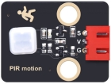
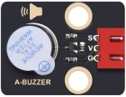
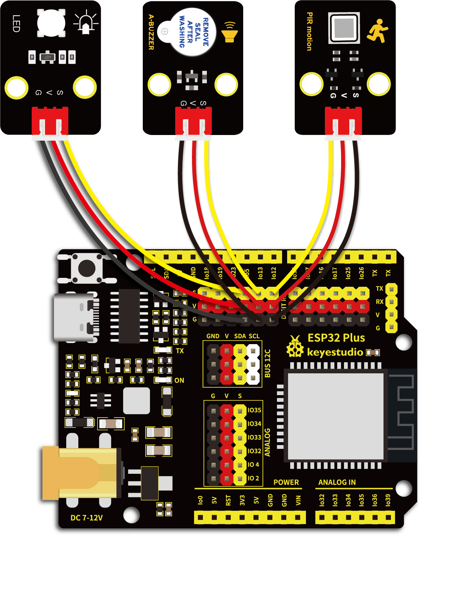

# 第二十九课 入侵检测报警器

## 1.1 项目介绍

上一课实验中我们学习了使用避障传感器检测障碍物进行报警提醒。在这一实验课程中我们将人体红外热释传感器、紫色LED模块和有源蜂鸣器模块组合实验，实现人体红外热释传感器检测到附近有人经过时有源蜂鸣器响起，紫色LED快速闪烁的效果。

---

## 1.2 实验组件

|  |      |  |
| ------------------------ | ---------------------------- | ------------------------ |
| ESP32 Plus主板 x1        | Keyes 人体红外热释传感器 x1  | Keyes 有源蜂鸣器模块 x1  |
|  |        |     |
| Keyes 紫色LED模块 x1     | XH2.54-3P 转杜邦线母单线  x3 | USB线  x1                |

---

## 1.3 模块接线图



---

## 1.4 实验代码

本项目中使用的代码保存在文件夹“<u>**3. Arduino教程\2. Windows 系统\1. 项目课程\代码**</u>”中，我们可以在此路径下打开代码文件''**PIR_alarm.ino**"。

**注意：为了避免上传代码不成功，请上传代码前不要连接模块。代码上传成功后，拔下USB线断电，按照接线图正确接好模块后再用USB线连接到计算机上电，观察实验结果。**

```c++
/*  
 * Filename    : PIR alarm
 * Description : PIR control buzzer
 * Auther      : http//www.keyestudio.com
*/
int item = 0;
void setup() {
  pinMode(12, INPUT);  //PIR motion sensor is connected to GPIO12 and set as the input mode
  pinMode(13, OUTPUT);//The active buzzer is connected to GPIO13 and set to output mode
  pinMode(5, OUTPUT);//LED is connected to GPIO5 and set to output mode
}

void loop() {
  item = digitalRead(12);//Read digital level signal output by infrared pyrorelease sensor
  if (item == 1) {  //Movement detected
    digitalWrite(13, HIGH); //Turn on the buzzer
    digitalWrite(5, HIGH); //Turn on the LED
    delay(200);//Delay 200ms
    digitalWrite(13, LOW); //Turn off the buzzer
    digitalWrite(5, LOW); //Turn off the LED
    delay(200);//Delay 200ms
  } else {  //No detection
    digitalWrite(13, LOW); //Turn off the buzzer
    digitalWrite(5, LOW); //Turn off the LED
  }
}
```

ESP32主板通过USB线连接到计算机后开始上传代码。为了避免将代码上传至ESP32主板时出现错误，必须选择与计算机连接正确的控制板和串行端口。

点击“**<u>工具</u>**”→“**<u>开发板</u>**”，可以查看到各种不同型号ESP32开发板，选择对应的ESP32开发板型号。

点击“<u>**工具**</u>”→“**<u>端口</u>**”，选择对应的串行端口。

**注意：将ESP32主板通过USB线连接到计算机后才能看到对应的串行端口**。

单击将代码上传到ESP32主控板，等待代码上传成功后查看实验结果。

---

## 1.5 实验结果

代码上传成功后，拔下USB线断电，按照接线图正确接好模块后再用USB线连接到计算机上电。当人体红外热释传感器检测到附近有人经过时，人体红外热释传感器上的红灯灭，有源蜂鸣器发出警报，紫色LED灯快速闪烁。


---

## 1.6 代码说明

| 代码                   | 说明                                     |
| ---------------------- | ---------------------------------------- |
| item = digitalRead(12) | 人体红外热释传感器读取数字电平信号输出。 |
| item == 1              | 运动检测，检测到有人经过。               |
| digitalWrite(13, HIGH) | 有源蜂鸣器响起发出警报。                 |
| digitalWrite(5, HIGH)  | 紫色LED灯快速闪烁。                      |

 
