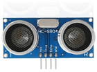
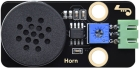
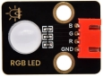
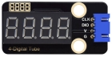
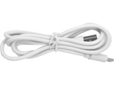

# 第三十三课 超声波雷达

## 1.1 项目介绍

蝙蝠飞行与获取猎物是通过回声定位的。回声定位：某些动物能通过口腔或鼻腔把从喉部产生的超声波发射出去，利用折回的声音来定向，这种空间定向的方法称为回声定位。科学家们从蝙蝠身上得到的启示发明了雷达，即雷达的天线相当于蝙蝠的嘴,而天线发出的无线电波就相当于蝙蝠的超声波,雷达接收电波的荧光屏就相当于蝙蝠的耳朵。

这一课我们就来学习制作一个简易雷达。将HC-SR04 超声波传感器、8002b功放 喇叭模块、共阴RGB模块和TM1650四位数码管模块组合实验，利用距离大小控制功放喇叭模块模块响起对应频率的声音、RGB亮起对应颜色，然后把这个距离显示在四位数码管上。这样就搭建好了一个简易的超声波雷达系统。

---

## 1.2 实验组件

|      |  |       |
| ---------------------------- | ---------------------------- | ----------------------------- |
| ESP32 Plus主板 x1            | HC-SR04 超声波传感器 x1      | Keyes 超声波转接模块 x1       |
|      |      |       |
| Keyes 8002b功放 喇叭模块 x1  | Keyes 共阴RGB模块 x1         | Keyes TM1650四位数码管模块 x1 |
|        |        |          |
| XH2.54-3P 转杜邦线母单线  x1 | XH2.54-4P 转杜邦线母单线  x3 | USB线  x1                     |

---

## 1.3 模块接线图


---

## 1.4 实验代码

本项目中使用的代码保存在文件夹“<u>**3. Arduino教程\2. Windows 系统\1. 项目课程\代码**</u>”中，我们可以在此路径下打开代码文件''**Ultrasonic_radar.ino**"。

**注意：为了避免上传代码不成功，请上传代码前不要连接模块。代码上传成功后，拔下USB线断电，按照接线图正确接好模块后再用USB线连接到计算机上电，观察实验结果。**

```c++
/*  
 * Filename    : Ultrasonic radar
 * Description : Ultrasonic control four digit tube, buzzer and RGB analog ultrasonic radar.
 * Auther      : http//www.keyestudio.com
*/
#include "TM1650.h" //Import the TM1650 library file
//the interfaces are GPIO21 and GPIO22
#define DIO 21
#define CLK 22
TM1650 DigitalTube(CLK,DIO);

#define BUZZER_PIN  2    //Define the horn pin as GPIO2

int TrigPin = 13; //Set the Trig pin to GPIO13
int EchoPin = 12; //Set the Echo pin to GPIO12
int distance;     //Distance measured by ultrasound

int ledPins[] = {4, 32, 33};    //define red, green, blue led pins
const byte chns[] = {0, 1, 2};        //define the pwm channels

float checkdistance() { //get distance
  // A short low level is given beforehand to ensure a clean high pulse:
  digitalWrite(TrigPin, LOW);
  delayMicroseconds(2);
  // The sensor is triggered by a high pulse of 10 microseconds or more
  digitalWrite(TrigPin, HIGH);
  delayMicroseconds(10);
  digitalWrite(TrigPin, LOW);
  // Read the signal from the sensor: a high level pulse
  // Its duration is the time (in microseconds) from sending the ping command to receiving the echo from the object
  float distance = pulseIn(EchoPin, HIGH) / 58.00;  //Convert to distance
  delay(300);
  return distance;
}

void setup() {
  pinMode(BUZZER_PIN, OUTPUT);  // Set the buzzer to output mode
  ledcSetup(3, 660, 13);        //setup the pwm channels,660Hz,13bit
  ledcAttachPin(BUZZER_PIN, 3);

  DigitalTube.setBrightness();  //set brightness, 0---7, default : 2
  DigitalTube.displayOnOFF();   //display on or off, 0=display off, 1=display on, default : 1
  for(char b=1;b<5;b++){
    DigitalTube.clearBit(b);    //DigitalTube.clearBit(0 to 3); Clear bit display.
  }
  
  DigitalTube.displayBit(1,0);  //DigitalTube.Display(bit,number); bit=0---3  number=0---9
  pinMode(TrigPin, OUTPUT);     //Sets the Trig pin as output
  pinMode(EchoPin, INPUT);      //Set the Echo pin as input
  for (int i = 0; i < 3; i++) { //setup the pwm channels,1KHz,8bit
    ledcSetup(chns[i], 1000, 8);
    ledcAttachPin(ledPins[i], chns[i]);
  }
}

void loop() {
  distance = checkdistance(); //Ultrasonic ranging
  displayFloatNum(distance);  //Nixie tube shows distance
  if (distance <= 10) {   
    ledcWrite(3, 50);
    delay(10);
    ledcWrite(chns[0], 255); //Common cathode LED, high level to turn on the led.
    ledcWrite(chns[1], 0);
    ledcWrite(chns[2], 0);

  } else if (distance > 10 && distance <= 20) {
    ledcWrite(3, 0);
    ledcWrite(chns[0], 0); 
    ledcWrite(chns[1], 255);
    ledcWrite(chns[2], 0);
  } else {
    ledcWrite(3, 0);
    ledcWrite(chns[0], 0);
    ledcWrite(chns[1], 0);
    ledcWrite(chns[2], 255);
  }
}

void displayFloatNum(float distance){
  if(distance > 9999)
    return;
  int dat = distance*10;
   //DigitalTube.displayDot(2,true); //Bit0 display dot. Use before displayBit().
  if(dat/10000 != 0){
    DigitalTube.displayBit(0, dat%100000/10000);  
    DigitalTube.displayBit(1, dat%10000/1000);
    DigitalTube.displayBit(2, dat%1000/100);
    DigitalTube.displayBit(3, dat%100/10);
    return;
  }
  if(dat%10000/1000 != 0){
    DigitalTube.clearBit(0); 
    DigitalTube.displayBit(1, dat%10000/1000); 
    DigitalTube.displayBit(2, dat%1000/100);
    DigitalTube.displayBit(3, dat%100/10);
    return;
  }
  if(dat%1000/100 != 0){
  DigitalTube.clearBit(0); 
  DigitalTube.clearBit(1);
  DigitalTube.displayBit(2, dat%1000/100);
  DigitalTube.displayBit(3, dat%100/10);  
  return;
}
  DigitalTube.clearBit(0); 
  DigitalTube.clearBit(1);
  DigitalTube.clearBit(2);
  DigitalTube.displayBit(3, dat%100/10);
}
```

ESP32主板通过USB线连接到计算机后开始上传代码。为了避免将代码上传至ESP32主板时出现错误，必须选择与计算机连接正确的控制板和串行端口。

点击“**<u>工具</u>**”→“**<u>开发板</u>**”，可以查看到各种不同型号ESP32开发板，选择对应的ESP32开发板型号。

点击“<u>**工具**</u>”→“**<u>端口</u>**”，选择对应的串行端口。

**注意：将ESP32主板通过USB线连接到计算机后才能看到对应的串行端口**。

单击将代码上传到ESP32主控板，等待代码上传成功后查看实验结果。

---

## 1.5 实验结果

代码上传成功后，拔下USB线断电，按照接线图正确接好模块后再用USB线连接到计算机上电。

当超声波传感器检测到障碍物距离范围在10cm 以内时，RGB LED灯亮红色，并将检测到障碍物的距离显示在四位数码管上。同时8002b功放 喇叭模块发出声响，起到提示的作用。


当超声波传感器检测到障碍物距离范围在10cm ~ 20cm 以内时，RGB LED灯亮绿色，并将检测到障碍物的距离显示在四位数码管上。


当超声波传感器检测到障碍物距离范围在20cm 以外时，RGB LED灯亮蓝色，并将检测到障碍物的距离显示在四位数码管上。


---

## 1.6 代码说明

| 代码                                             | 说明                                           |
| ------------------------------------------------ | ---------------------------------------------- |
| digitalWrite(TrigPin, LOW); delayMicroseconds(2) | 事先给一个短的低电平，以确保一个干净的高脉冲。 |

 
