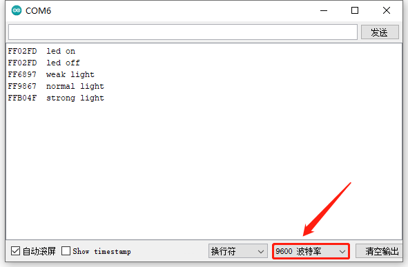

# 第三十四课 红外遥控灯

## 1.1 项目介绍

在前面实验中，我们学会了点亮或熄灭LED、学会了利用PWM调节灯光的亮度、学会了使用红外接收模块，并将接收到的遥控器对应的键值打印出来。在这一实验课程中，我们将红外接收模块和紫色LED模块组合实验，实现用红外遥控器控制紫色LED的亮灭以及控制紫色LED显示不同亮度。

当红外接收模块接收到红外遥控器的按键值时，通过设置此按键值的输出PWM值实现设置不同LED亮度的效果，控制LED的亮灭也一样。

在这一实验课程中我们使用 “①“、”②“、”③”三个按键来控制紫色LED实现弱亮、正常亮、强亮三种不同亮度。如果想要使用 “OK” 键这一个按键来控制LED亮和灭的两种情况该如何实现呢？这一实验课程我们将学习使用一个新的基本数据类型 —— boolean，来实现同一个按键控制LED亮灭的效果。

**boolean 数据类型**，变量存储为 8位（1 个字节）的数值形式，**只能是 True 或是 False**。boolean 变量的值显示为 True 或 False（在使用 Print 的时候），或者 #TRUE# 或 #FALSE#（在使用 Write # 的时候）。使用关键字True 与 False 可将 boolean 变量赋值为这两个状态中的一个。

设置代码，按下“OK”键且满足某一条件，点亮LED；按下“OK”键且满足另一条件，熄灭LED。这个条件我们用 boolean 来实现是最简单方便的，因为 boolean 只有 True 或是 False 两种状态。我们只需要设置按下“OK”键的同时 flag 为 true，即可点亮LED；同理按下“OK”键的同时 flag 为 false，熄灭LED。

---

## 1.2 实验组件

|          |      |  |
| -------------------------------- | ---------------------------- | ------------------------ |
| ESP32 Plus主板 x1                | Keyes 红外接收模块 x1        | Keyes 紫色LED模块 x1     |
|  |        |     |
| Keyes 遥控器 x1                  | XH2.54-3P 转杜邦线母单线  x2 | USB线  x1                |

---

## 1.3 模块接线图


---

## 1.4 实验代码

本项目中使用的代码保存在文件夹“<u>**3. Arduino教程\2. Windows 系统\1. 项目课程\代码**</u>”中，我们可以在此路径下打开代码文件''**IR_control_LED.ino**"。

**注意：为了避免上传代码不成功，请上传代码前不要连接模块。代码上传成功后，拔下USB线断电，按照接线图正确接好模块后再用USB线连接到计算机上电，观察实验结果。**

```c++
/*  
 * Filename    : IR Control LED
 * Description : Remote controls LED on and off
 * Auther      : http//www.keyestudio.com
*/
#include <Arduino.h>
#include <IRremoteESP8266.h>
#include <IRrecv.h>
#include <IRutils.h>

const uint16_t recvPin = 35;  // Infrared receiving GPIO35
IRrecv irrecv(recvPin);       // Create a class object used to receive class
decode_results results;       // Create a decoding results class object
int led = 5;//LED connect to GPIO5
boolean flag = true;  //LED flag bit

void setup() {
  Serial.begin(9600);
  irrecv.enableIRIn();                  // Start the receiver
  pinMode(led, OUTPUT);
  ledcSetup(0, 1000, 8); //setup pwm channel
  ledcAttachPin(5, 0);  //attach the led pin to pwm channel
}

void loop() {
  if(irrecv.decode(&results)) {        // Waiting for decoding
    serialPrintUint64(results.value, HEX);// Print out the decoded results
    Serial.print("");
    handleControl(results.value);       // Handle the commands from remote control
    irrecv.resume();                    // Receive the next value
  }
}

void handleControl(unsigned long value){
  if (value == 0xFF02FD && flag == true){ // Receive the number 'OK'  
    ledcWrite(0, 170); //turn on LED
    delay(10);
    Serial.println("  led on");
    flag = false;
  } 
  else if (value == 0xFF02FD && flag == false){ // Receive the number 'OK'
    ledcWrite(0, 0); //turn on LED
    delay(10);
    Serial.println("  led off"); 
    flag = true;
  }
  else if(value == 0xFF6897){
    ledcWrite(0, 85);
    Serial.println("  weak light");
    delay(10);
  } 
  else if(value == 0xFF9867){
    ledcWrite(0, 170);
    delay(10);
    Serial.println("  normal light");
  } 
  else if(value == 0xFFB04F){
    ledcWrite(0, 255);
    delay(10);
    Serial.println("  strong light");
  }
}
```

ESP32主板通过USB线连接到计算机后开始上传代码。为了避免将代码上传至ESP32主板时出现错误，必须选择与计算机连接正确的控制板和串行端口。

点击“**<u>工具</u>**”→“**<u>开发板</u>**”，可以查看到各种不同型号ESP32开发板，选择对应的ESP32开发板型号。

点击“<u>**工具**</u>”→“**<u>端口</u>**”，选择对应的串行端口。

**注意：将ESP32主板通过USB线连接到计算机后才能看到对应的串行端口**。

单击将代码上传到ESP32主控板，等待代码上传成功后查看实验结果。

---

## 1.5 实验结果

代码上传成功后，拔下USB线断电，按照接线图正确接好模块后再用USB线连接到计算机上电，打开串口监视器，设置波特率为**<u>9600</u>**。

第一次按下红外遥控器上的 “**<u>OK</u>**” 键，紫色LED被点亮，实现开灯的效果。串口监视器打印出按下的按键值和LED灯的亮灭情况：“**<u>FF02FD  led on</u>**” 。

再次按下红外遥控器上的 “**<u>OK</u>**” 键，紫色LED熄灭，实现关灯的效果。串口监视器打印出按下的按键值和LED灯的亮灭情况：“**<u>FF02FD  led off</u>**” 。

按下红外遥控器上的 “**①**” 键，紫色LED被设置为弱亮。串口监视器打印出按下的按键值和LED灯的亮灭情况：“**<u>FF6897  weak light</u>**” 。

按下红外遥控器上的 “**②**” 键，紫色LED被设置为正常亮。串口监视器打印出按下的按键值和LED灯的亮灭情况：“**<u>FF9867  normal light</u>**” 。

按下红外遥控器上的 “**③**” 键，紫色LED被设置为强亮。串口监视器打印出按下的按键值和LED灯的亮灭情况：“**<u>FFB04F  strong light</u>**” 。



---

## 1.6 代码说明

| 代码                | 说明                                                         |
| ------------------- | ------------------------------------------------------------ |
| boolean flag = true | 设置一个变量 flag 为 boolean 数据类型，数值为 true。         |
| flag = false        | boolean 数据类型的 flag 赋值为 false ，以便再次按下再次按下 “OK”键时满足熄灭LED的条件。 |

 
