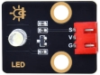
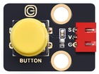
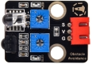
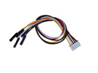
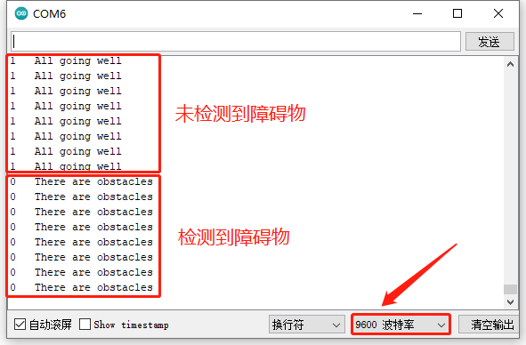
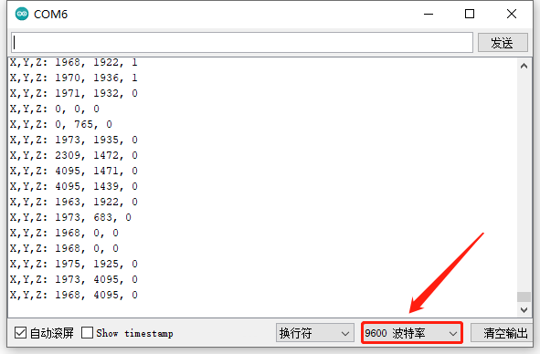
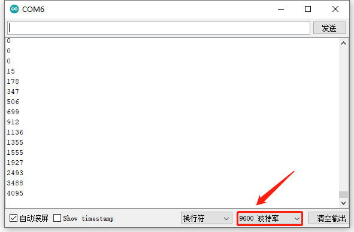
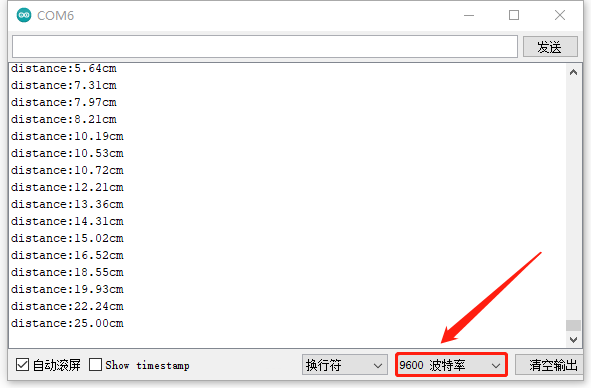

# 第三十九课 综合实验

## 1.1 项目介绍

从上一课实验中我们学习了利用避障传感器检测障碍物进行报警提醒。在这一实验课程中我们将人体红外热释传感器、紫色LED模块和有源蜂鸣器模块组合实验，实现人体红外热释传感器检测到附近有人经过时有源蜂鸣器响起，紫色LED快速闪烁的效果。

我们已经学习了所有的模块和传感器的使用方法，也学习了将它们搭配在一起组合实验。在这一实验课程中我们将搭配更多的模块和传感器组合在一起。参考前面实验编程的方法，利用按键模块，实现每按一次按键，功能就变换一次的效果。

实验多种多样，大家可以发挥想象力，搭配模块和传感器做出更多具有意义的实验。

---

## 1.2 实验组件

|      |  |      |      |
| ---------------------------- | ------------------------ | ---------------------------- | ---------------------------- |
| ESP32 Plus主板 x1            | Keyes 紫色LED模块 x1     | Keyes 单路按键模块 x1        | Keyes 旋转电位器模块 x1      |
|      |  |  |      |
| Keyes 避障传感器 x1          | Keyes 摇杆模块 x1        | HC-SR04 超声波传感器 x1      | Keyes 超声波转接模块 x1      |
|      |     |        |        |
| Keyes 共阴RGB模块 x1         | USB线  x1                | XH2.54-3P 转杜邦线母单线  x4 | XH2.54-4P 转杜邦线母单线  x2 |
|        |                          |                              |                              |
| XH2.54-5P 转杜邦线母单线  x1 |                          |                              |                              |

---

## 1.3 模块接线图


---

## 1.4 实验代码

本项目中使用的代码保存在文件夹“<u>**3. Arduino教程\2. Windows 系统\1. 项目课程\代码**</u>”中，我们可以在此路径下打开代码文件''**Comprehensive_experiment.ino**"。

**注意：为了避免上传代码不成功，请上传代码前不要连接模块。代码上传成功后，拔下USB线断电，按照接线图正确接好模块后再用USB线连接到计算机上电，观察实验结果。**

```c++
/*
 * Filename    : Comprehensive experiment
 * Description : Multiple sensors/modules work together
 * Auther      : http//www.keyestudio.com
*/
//rgb is connected to 2,4,32
int ledPins[] = {2, 4, 32};    //define red, green, blue led pins
const byte chns[] = {0, 1, 2};        //define the pwm channels
int red, green, blue;

//Rocker module port
int xyzPins[] = {33, 34, 18};   //x,y,z pins

//Potentiometer pin is connected to port 35
int resPin = 35;

//Obstacle avoidance sensor pin connected to IO port 14
int Avoid = 14;

//LED is Connected to GP5
#define PIN_LED   5  // the pin of the LED
#define CHAN    3    // ledc 3

//Ultrasonic sensor port
int Trig = 13;
int Echo = 12;

//Key module port
int button = 23;

int PushCounter = 0;//Store the number of times a key is pressed
int yushu = 0;
unsigned char dht[4] = {0, 0, 0, 0};//Only the first 32 bits of data are received, not the parity bits
bool ir_flag = 1;
float out_X, out_Y, out_Z;

void counter() {
  delay(10);
  ir_flag = 0;
  if (!digitalRead(button)) {
    PushCounter++;
  }
}

void setup() {
  Serial.begin(9600);//Set baud rate to 9600
  pinMode(xyzPins[0], INPUT); //x axis. 
  pinMode(xyzPins[1], INPUT); //y axis. 
  pinMode(xyzPins[2], INPUT_PULLUP);   //z axis is a button.
  ledcSetup(CHAN, 1000, 12);
  ledcAttachPin(PIN_LED, CHAN);
  pinMode(button, INPUT);//The key module
  attachInterrupt(digitalPinToInterrupt(button), counter, FALLING);  //External interrupt 0, falling edge fired
  pinMode(Avoid, INPUT);//Obstacle avoidance sensor
  pinMode(Trig, OUTPUT);//Ultrasonic module
  pinMode(Echo, INPUT);
  for (int i = 0; i < 3; i++) {   //setup the pwm channels,1KHz,8bit
    ledcSetup(chns[i], 1000, 8);
    ledcAttachPin(ledPins[i], chns[i]);
  delay(1000);
 }
}

void loop() {
  yushu = PushCounter % 5;
  if (yushu == 0) {  //The remainder is 0
    yushu_0();  //rgb displays
  } else if (yushu == 1) {  //The remainder is 1
    yushu_1();  //Obstacle avoidance sensor detects obstacles
  } else if (yushu == 2) {  //The remainder is 2
    yushu_2();  //Displays the rocker value
  } else if (yushu == 3) {  //The remainder is 3
    yushu_3();  //Display potentiometer ADC value and potentiometer control LED
  } else if (yushu == 4) {  //The remainder is 4
    yushu_4();  //Shows the distance detected by ultrasound
  } 
}

//RGB
void yushu_0() {
  red = random(0, 256);
  green = random(0, 256);
  blue = random(0, 256);
  setColor(red, green, blue);
  delay(200);
}
void setColor(byte r, byte g, byte b) {
  ledcWrite(chns[0], 255 - r); //Common anode LED, low level to turn on the led.
  ledcWrite(chns[1], 255 - g);
  ledcWrite(chns[2], 255 - b);
}

void yushu_1() {
  int val = digitalRead(Avoid);//Read the digital level output by the Obstacle avoidance sensor
  Serial.print(val);//Serial port print value
  if (val == 0) {//Obstruction detected
    Serial.println("   There are obstacles");
  }
  else {//No obstructions detected
    Serial.println("   All going well");
  }
  delay(100);
}

void yushu_2() {
  int xVal = analogRead(xyzPins[0]);
  int yVal = analogRead(xyzPins[1]);
  int zVal = digitalRead(xyzPins[2]);
  Serial.println("X,Y,Z: " + String(xVal) + ", " +  String(yVal) + ", " + String(zVal));
  delay(500);
}

void yushu_3() {
  int adcVal = analogRead(resPin); //read adc
  Serial.println(adcVal);
  int pwmVal = adcVal;        // adcVal re-map to pwmVal
  ledcWrite(CHAN, pwmVal);    // set the pulse width.
  delay(100);
}

void yushu_4() {
  float distance = checkdistance();
  Serial.print("distance:");
  Serial.print(distance);
  Serial.println("cm");
  delay(100);
}

float checkdistance() {
  digitalWrite(Trig, LOW);
  delayMicroseconds(2);
  digitalWrite(Trig, HIGH);
  delayMicroseconds(10);
  digitalWrite(Trig, LOW);
  float distance = pulseIn(Echo, HIGH) / 58.00;
  delay(10);
  return distance;
}
```

ESP32主板通过USB线连接到计算机后开始上传代码。为了避免将代码上传至ESP32主板时出现错误，必须选择与计算机连接正确的控制板和串行端口。

点击“**<u>工具</u>**”→“**<u>开发板</u>**”，可以查看到各种不同型号ESP32开发板，选择对应的ESP32开发板型号。

点击“<u>**工具**</u>”→“**<u>端口</u>**”，选择对应的串行端口。

**注意：将ESP32主板通过USB线连接到计算机后才能看到对应的串行端口**。

单击将代码上传到ESP32主控板，等待代码上传成功后查看实验结果。

---

## 1.5 实验结果

代码上传成功后，拔下USB线断电，按照接线图正确接好模块后再用USB线连接到计算机上电，打开串口监视器，设置波特率为**<u>9600</u>**。

（1）初始时没有按下按键，按键次数为 0 ，余数为 0 ，RGB模块循环闪烁随机颜色。


（2）按一下按键（时间稍长以便能检测到按键按下），RGB LED灯停止闪烁。此时按键次数为 1 ，余数为 1 ，实验实现避障传感器检测障碍物并读取高低电平的功能。

当传感器没有检测到障碍物时，val为**<u>1</u>**，串口监视器打印出 “**<u>1  All going well</u>**” ，灯 SLED **<u>不亮</u>**；
当传感器检测到障碍物时，val为**<u>0</u>**，串口监视器打印出 “**<u>0  There are obstacles</u>**” ，灯 SLED **<u>亮</u>**。




**注意：如果在打开串口监视器之前<u>先按下按键</u>，按键次数变为1。再打开串口监视器时程序会复位，按键成次数会变为0，需要再次按下按键重新设置按键次数为1。**

（3）再按一下按键，按键次数为 2 ，余数为 2 。实验实现读取当前摇杆X轴和Y轴对应的模拟值以及Z轴（B接口）对应的数字值的功能。串口监视器打印出当前摇杆X轴、Y轴和Z轴对应的值。



（4）再按一下按键，按键次数为 3 ，余数为 3 。实验实现利用可调电位器模块调节 LED（GPIO5）接口输出的PWM值，从而调节紫色LED模块上LED亮度的功能。串口监视器打印出当前输出的模拟值。



（5）再按一下按键，按键次数为 4 ，余数为 4 。实验实现的功能是利用超声波模块检测距离并在串口打印出来，串口监视器显示图如下。



（6）再按一下按键，按键次数为 5 ，余数为 0 。实现初始时RGB循环闪烁随机颜色的效果。不断地按下按键，余数循环变化，实验功能也循环变化。
