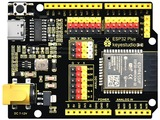
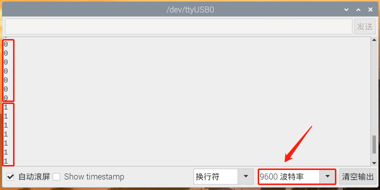

# 第八课 倾斜模块的原理

## 1.1 项目介绍

在这个套件中，有一个Keyes 倾斜传感器，主要由一个倾斜开关组成，其内部带有一颗滚珠，用来监测倾斜情况。倾斜开关可以依据模块是否倾斜而输出不同的电平信号。当开关高于水平位置倾斜时开关导通，低于水平位置时开关断开。倾斜模块可用于倾斜检测、报警器制作或者其他检测。

---

## 1.2 模块参数

工作电压 : DC 3.3 ~ 5V 

电流 : 50 mA

最大功率 : 0.3 W

工作温度 ：-10°C ~ +50°C

输出信号 : 数字信号

尺寸 ：32 x 23.8 x 8 mm

定位孔大小：直径为 4.8 mm

接口 ：间距为2.54 mm 3pin防反接口

---

## 1.3 模块原理图


Keyes 倾斜传感器的原理非常简单，主要是利用滚珠在开关内随不同倾斜角度的变化使滚珠开关P1的引脚1和2导通或者不导通，当滚珠开关P1的引脚1和2导通时，由于1脚接GND，所以信号端S被拉低为低电平，此时红色LED和R2组成的电路形成回路，电流经过红色LED，点亮红色LED；当滚珠开关P1的引脚1和2不导通时，滚珠开关P1的引脚2被4.7K的上拉电阻R1拉高使得信号端S为高电平，电流不经过红色LED，红色LED熄灭。


---

## 1.4 实验组件

|  |  |        |  |
| ------------------------ | ------------------------ | ---------------------------- | --------------------- |
| ESP32 Plus主板 x1        | Keyes 倾斜传感器 x1      | XH2.54-3P 转杜邦线母单线  x1 | USB线  x1             |

---

## 1.5 模块接线图


---

## 1.6 实验代码

本项目中使用的代码保存在文件夹“<u>**/home/pi/代码**</u>”中，我们可以在此路径下打开代码文件''**Tilt switch.ino**"。

**注意：为了避免上传代码不成功，请上传代码前不要连接模块。代码上传成功后，拔下USB线断电，按照接线图正确接好模块后再用USB线连接到树莓派上电，观察实验结果。**

```c++
/*
 * Filename    : Tilt switch
 * Description : Reading the tilt sensor value
 * Auther      :http://www.keyestudio.com
*/
int val; //Store the level value output by the tilt sensor

void setup() {
  Serial.begin(9600);
  pinMode(5, INPUT);  //Connect the pin of the tilt sensor to GP5 and set GP5 to the input mode
}

void loop() {
  val = digitalRead(5); //Read module level signal
  Serial.println(val);  //Newline print
  delay(100); //Delay for 100 ms
}
```

ESP32主板通过USB线连接到树莓派后开始上传代码。为了避免将代码上传至ESP32主板时出现错误，必须选择与树莓派连接正确的控制板和串行端口。

点击“**<u>工具</u>**”→“**<u>开发板</u>**”，可以查看到各种不同型号ESP32开发板，选择对应的ESP32开发板型号。

点击“<u>**工具**</u>”→“**<u>端口</u>**”，选择对应的串行端口；点击“<u>**工具**</u>”→“**<u>Upload Speed</u>**”，选择对应的上传速率。

**注意：将ESP32主板通过USB线连接到树莓派后才能看到对应的串行端口**。

单击将代码上传到ESP32主控板，等待代码上传成功后查看实验结果。

---

## 1.7 实验结果

代码上传成功后，拔下USB线断电，按照接线图正确接好模块后再用USB线连接到树莓派上电，打开串口监视器，设置波特率为**<u>9600</u>**。

将倾斜模块往某一边倾斜，若模块上的红色LED**不亮**，串口监视器打印数字电平信号“**1**”；若模块上的红色LED点**亮**，串口监视器打印数字电平信号“**0**”。




---

## 1.8 代码说明

此课程代码与第六课代码类似，这里就不多做介绍了。

